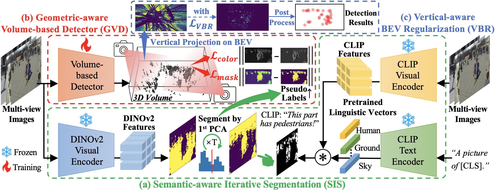
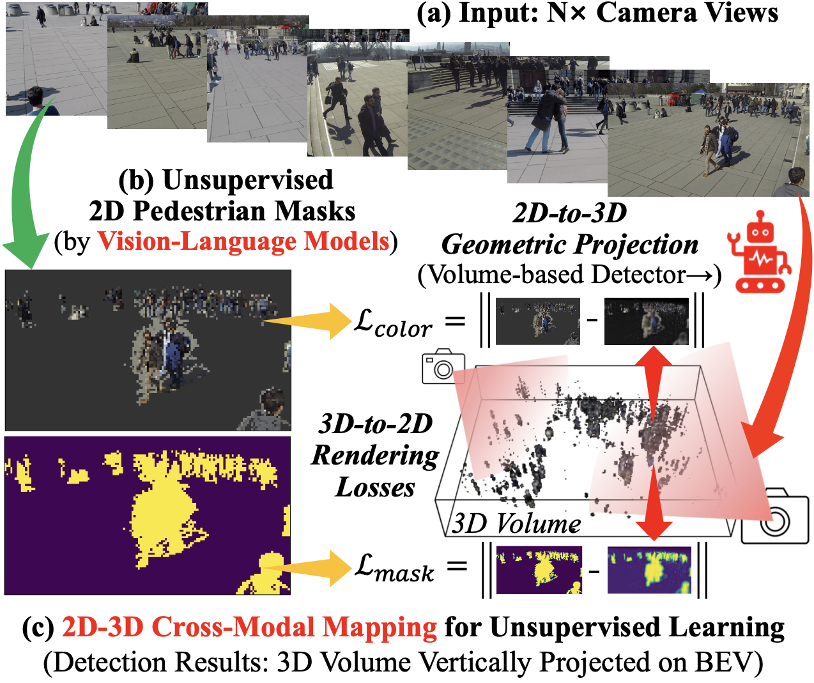
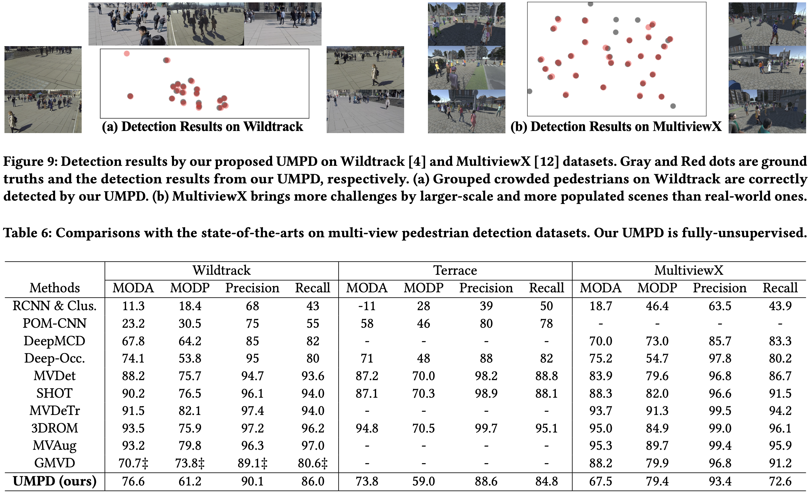

# UMPD
Official Code of ACM MM'24 Paper "Unsupervised Multi-view Pedestrian Detection"

\[[Paper](https://doi.org/10.1145/3664647.3681560)\] \[[arXiv](https://arxiv.org/abs/2305.12457)] \[[Supplementary Materials](https://lmy98129.github.io/academic/src/UMPD-Appendix.pdf)\] 



## Introduction


We propose a novel approach via Unsupervised Multi-view Pedestrian Detection (UMPD) to eliminate the high dependency of the current mainstream supervised multi-view pedestrian detection methods on the laborious manual labels: 

* Firstly, Semantic-aware Iterative Segmentation (SIS) method is proposed to extract the PCA values of DINOv2 representations, and segment them into 2D masks as pseudo labels. To identify the pedestrians, iterative PCA is adopted with zero-shot semantic classes of vision-language model CLIP. 
	
* Secondly, we propose Geometric-aware Volume-based Detector (GVD) to encode multi-view 2D images into a 3D volume via geometry, and learn to predict 3D density and color from this volume via rendering losses with SIS pseudo labels. 
	
* Thirdly, Vertical-aware BEV Regularization (VBR) method is further proposed to constrain the predicted 3D density to be vertical on BEV, following the natural pedestrian poses.  
	
* Finally, formed by these key components, our proposed UMPD, as **the 1<sup>st</sup> fully-unsupervised method in this field to our best knowledge**, performs competitively on popular Wildtrack, Terrace, and MultiviewX datasets, especially compared with the previous supervised methods.



## Contents
1. [Introduction](#introduction)
1. [Environment](#step-1-environment)
2. [Dataset](#step-2-dataset)
3. [Training](#step-3-training)
4. [Evaluation](#step-4-evaluation)

## STEP 1: Environment

1. Software and hardware requirements: 
    * Install the conda (miniconda3 is recommended) for creating environment.
    * Matlab 2021a (or above) is recommended for evaluation scripts.
    * At least one Nvidia GPU which supports CUDA 11 is required. (*> 24G x 4 for training is recommended*)

2. Create conda environment:
    * Modify the "name" item of "environment.yaml" to name the environment, and change the "prefix" item to your conda path. 
    * Run "conda env create -f environment.yaml" to create a new environment.
    * If some install errors occur due to invalid CUDA versions of PyTorch-related packages by PIP, try install the *.whl files manually from [official site](https://download.pytorch.org/whl/torch_stable.html). 

4. Install the PIP package of CLIP
    * Please refer to the official repository [openai/CLIP](https://github.com/openai/CLIP). And install it via "pip3" of the created conda environment.
    * Download the ResNet50-CLIP weight: [RN50.pt](https://openaipublic.azureedge.net/clip/models/afeb0e10f9e5a86da6080e35cf09123aca3b358a0c3e3b6c78a7b63bc04b6762/RN50.pt).
    * Keep "clip_path" item in "config.py" consistent to where this weight is saved.

5. Install DINOv2 from PyTorch Hub

    * By default, code and weight is auto-downloaded via PyTorch Hub. The line 101 code in [gen_sis_labels.py](gen_sis_labels.py) should be modified according to DINOv2 official repository: 
        ```
        dinov2_vitb14 = torch.hub.load('facebookresearch/dinov2', 'dinov2_vitb14')
        ```

    * In this repository, for offline installation of dinov2 weight, please specify the "dino_path" item of "config.py" with the path to user folder, and clone the [official DINOv2 repository](https://github.com/facebookresearch/dinov2) to this path: 
        ```
        self.dino_path = '/path/to/user/folder/.cache/torch/hub/facebookresearch_dinov2_main'
        ```

    * Then, the [DINOv2 weight](https://dl.fbaipublicfiles.com/dinov2/dinov2_vitb14/dinov2_vitb14_pretrain.pth) should be placed to "/.cache/torch/hub/checkpoints"

## STEP 2: Dataset

1. For Wildtrack:
    * Following the instruction of official repository on [EPFL CVLAB](https://www.epfl.ch/labs/cvlab/data/data-wildtrack/), download the annotated dataset (frames & annotations, only frames are needed) "Wildtrack_dataset_full.zip". 

    * If the "data_path" in "config.py" is "/root/data", place frame images in the path format like:
        ```
        /root/data/Wildtrack/Image_subsets/C1/00000000.png
        ...
        /root/data/Wildtrack/Image_subsets/C7/00001845.png
        ```

2. For MultiviewX:
    * Following the instruction of [hou-yz/MVDet](https://github.com/hou-yz/MVDet) to download [MultiviewX dataset](https://github.com/hou-yz/MVDet?tab=readme-ov-file#download-multiviewx). Then the path format is kept the same with Wildtrack. 

3. For Terrace: 
    * Please clone the code of [xjtlu-cvlab/3DROM](https://github.com/xjtlu-cvlab/3DROM) and use the new version of this dataset following the format of Wildtrack and MultiviewX. 
    * For the original version and the details of the dataset, please refer to the webpage of [EPFL CVLAB](https://www.epfl.ch/labs/cvlab/data-pom-index-php/). 

* **NOTE**: If the download links on EPFL webpage are not available, please contact the authors of EPFL CVLAB. 

## STEP 3: Training

1. Hyper-parameters
    * Before generating or training, please change the "self.dataset" in "config.py" into the name of the current dataset. 
    * Shared hyper-parameters are also set in "config.py". And dataset specific ones are located in "datasets" codes. 

1. Generate 2D pseudo labels by our SIS
    * Run the python script `python gen_sis_labels.py`, then generated 2D pseudo labels will be stored at "tmp" folder named as `{self.dataset}Mask`, e.g., "WildtrackMask". 
    
2. Training
    * Run shell script `sh dist_train.sh` to train with multiple GPUs by default. 
    * To customize the GPU numbers, please refer to "2. GPU and Batch-Size" in [documents](https://github.com/lmy98129/VLPD/blob/main/docs/Others.md#about-training-configs) of our previous work [VLPD](https://github.com/lmy98129/VLPD) on single-view pedestrian detection. 
    * During each training, a new folder under "outputs" path is created, with two sub-folder "train" and "test".
        * In "train" folder, model weight are saved after each epoch, and visualization images between prediction and GT on a random frame in a batch are saved for each iteration. 
        * In "test" folder, the "test.txt" is saved as prediction results, and visualization images are saved for all the frames in test set. 
    * **NOTE:** For reproducibility, please refer to our previous VLPD [documents](https://github.com/lmy98129/VLPD/blob/main/docs/Others.md#about-reproducibility) as well. 

## STEP 4: Evaluation

1. Evaluation from "test.txt" files
    * Open the folder of "evaluation" in Matlab, and then open the script "eval_demo.m". 
    * Change the "res_fpath" of one "test.txt" file, and correponding dataset name in "gt_fpath" and final parameter of "evaluateDetection" for correct evaluation. 
    * Run the script, then MODA, MODP, Precision, and Recall scores are printed in the bottom of Matlab. 

2. Evaluation from model weights
    * Remember change the "self.dataset" in "config.py" into the name of the current dataset like previous generating and training phases. 
    * then specify the "weight-path" and "save-path" for model weights and output "test.txt" in "test.py" like: 
        ```
        python test.py --weight-path '/path/to/weight.pth' --save-path '/path/to/test.txt'
        ```
    * Run the script, then "test.txt" is obtainedto conduct the previous section "Evaluation from 'test.txt' files". 

* Checkpoints of our UMPD are available to download soon. 

* **NOTE:** Adjusting "val_begin" will affect the reproducibility, please refer to our previous VLPD [documents](https://github.com/lmy98129/VLPD/blob/main/docs/Others.md#about-reproducibility). 

## Citation
If you find our research helpful or make further research, please consider citing: 

```
@inproceedings{10.1145/3664647.3681560,
author = {Liu, Mengyin and Zhu, Chao and Ren, Shiqi and Yin, Xu-Cheng},
title = {Unsupervised Multi-view Pedestrian Detection},
year = {2024},
isbn = {9798400706868},
publisher = {Association for Computing Machinery},
address = {New York, NY, USA},
url = {https://doi.org/10.1145/3664647.3681560},
doi = {10.1145/3664647.3681560},
booktitle = {Proceedings of the 32nd ACM International Conference on Multimedia},
pages = {1034–1042},
numpages = {9},
keywords = {multi-view pedestrian detection, unsupervised learning},
location = {Melbourne VIC, Australia},
series = {MM '24}
}
```

For our more publications, please refer to Mengyin Liu's [Academic Page](https://lmy98129.github.io/academic) and Google Scholar of [Prof. Zhu](https://scholar.google.com/citations?user=4PookxMAAAAJ) and [Prof. Yin](https://scholar.google.com/citations?user=V3hiob0AAAAJ).


## Thanks
1. FAIR-PyTorch3D: [facebookresearch/pytorch3d](https://github.com/facebookresearch/pytorch3d)
2. FAIR-DINOv2: [facebookresearch/dinov2](https://github.com/facebookresearch/dinov2)
3. Official Repository of OpenAI-CLIP: [openai/CLIP](https://github.com/openai/CLIP)
4. Our VLPD for the CLIP Usage in the SIS of UMPD: [lmy98129/VLPD](https://github.com/lmy98129/VLPD)


